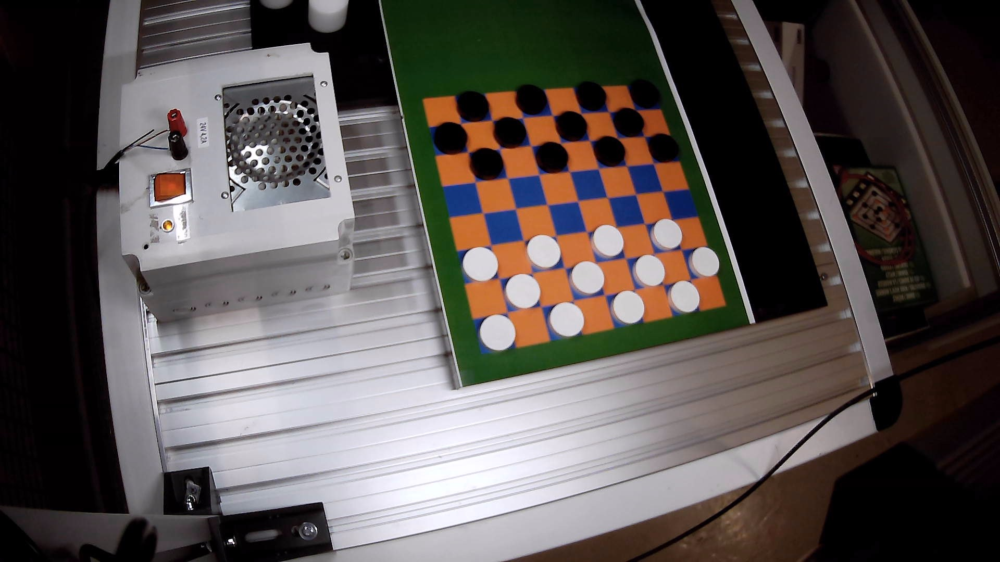

This is a program done for a Robotics project course in Tampere university in 2023-2024 by Eppu Hassinen.

The simple program gets the positions of black and white checkers pieces on a checkers board. The program saves the piece positions to a pieces.txt file for other programs to use.

Used libraries:
Python, version 3.11.5
cv2, version 4.8.1
numpy, version 1.26.0
imutils, version 0.5.4
time
glob
os

environment.yml file contains information about an anaconda environment. It can be installed in anaconda command line with the command: conda env create -f .\environment.yml. Anaconda can be installed from https://www.anaconda.com/download. Note that the environment contains some packages not needed.

Camera calibration. You need to have a webcam. Disable internal webcam so the program can only access the right one. Check the instructions in calibration/info.txt to take the calibration pictures. And run the camera_calibration.py

Used board is made with bright colors for the pieces to pop out more:

initialization.jpg needs to be a picture from your webcam (or the same resolution you plan to use) for the initialization of the program.

Using the program: After calibrating the cameras inner distortions like shown above. You can just run the program with command: python find_objects.py <mode> <demo>. The program asks you to calibrate board corners by clicking them in order top_left, top_right, bottom_left, bottom_right. This can be skipped if camera has not moved from previous runs. Black and white tresholds and the camera contrast and exposure may need some tuning depending on your lighting and colours.

Modes: the first argument modes are the following:
- live, default mode. Uses live picture from the webcam.
- record, same as live, but saves the unprocessed video from the webcam.
- video, looks as live, but uses the saved video as input instead of the webcam.

Demo:
- demo, if argument is demo, program shows more visual windows about how the program works.
